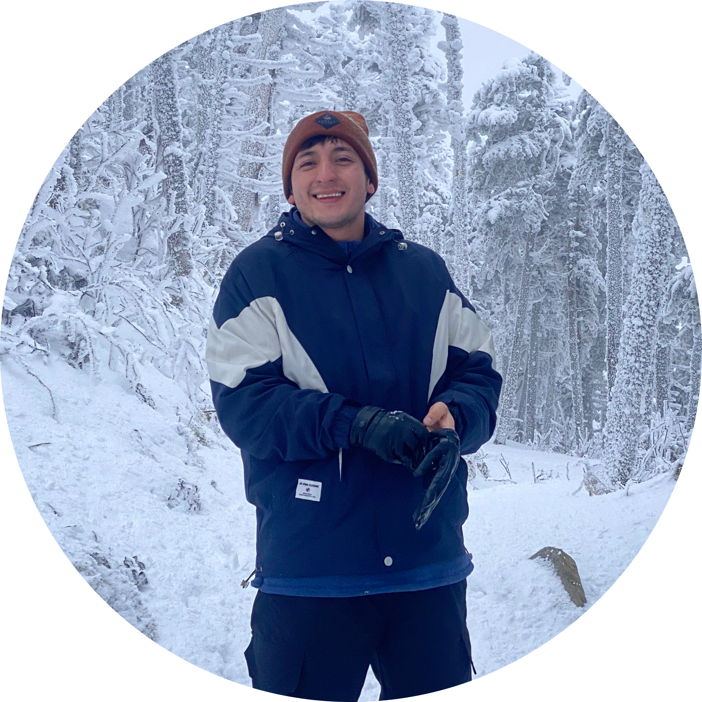

---
hide:
  - toc
---

# > Jorge Cardenas-Gamboas

  

 

I’m a computational physicist based in Dresden, Germany. I grew up in Ecuador, and currently I specialize in the study of materails using computational tools.

---

## Education

I obtained my bachelor's degree in Chemistry in 2020 at [Yachay Tech University](https://www.yachaytech.edu.ec/).

After that, I was accepted into the [Erasmus Mundus in Theoretical Chemistry and Computational Modelling](https://www.emtccm.org) program, which allowed me to move to Europe and study at two different universities: [Universitat de Barcelona](https://web.ub.edu/es/) and [Sorbonne Université](https://www.sorbonne-universite.fr).

I was then admitted to the [Max Planck Graduate Center](https://www.mpg.de/13833218/max-planck-graduate-center) program, where I joined the [Max Planck Institute for Chemical Physics of Solids](https://www.cpfs.mpg.de/en) in Dresden.

After two years, I moved to the [Leibniz Institute for Solid State and Materials Research Dresden (IFW Dresden)](https://www.ifw-dresden.de/), where I am currently working.

## Research

I focus on the theoretical modeling of quantum materials to accelerate the development of future technologies. My core areas of expertise include:

-Topological States: Studying Dirac fermions and electronic dimensionality.

-Quantum Control: Using light-matter interactions to drive material phase transitions.

-Magnetism: Investigating non-collinear magnetic structures for spintronics.

-Computational Automation: Developing Python-based workflows for complex physical systems.

## Interests

I am naturally curious and enjoy exploring different branches of Physics, Chemistry, and any field that broadens my understanding of the world. I believe that interdisciplinary knowledge is key to solving complex problems.

On a more personal note, I value cultural exchange and firmly believe in maintaining a healthy balance between work, health, and life. You’ll often find me boxing after a day at the lab or exploring new cities. I have a deep passion for music—whether I’m playing my guitar or discovering new genres—and I truly enjoy cooking at home, experimenting with flavors and techniques from around the world.

## Contact information

-email: [jorgeivan.cardenas97@gmail.com]()

-address: [Helmholtzstraße 20, 01069 Dresden](https://maps.app.goo.gl/eiB9H3HoueYe6XXs6)

-orcid: [0009-0007-6465-1311](https://orcid.org/0009-0007-6465-1311)
